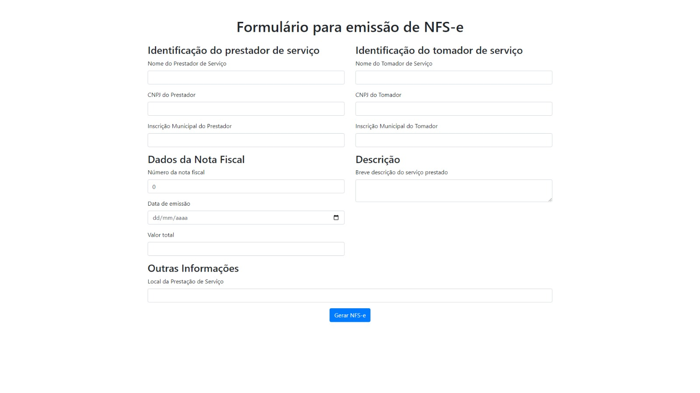
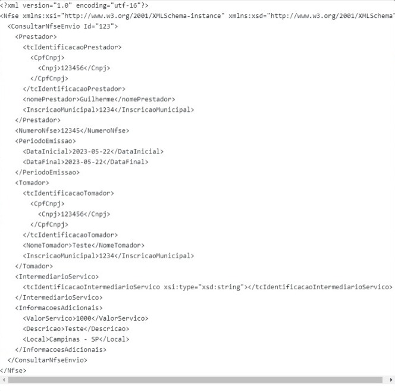

# GeradorNfse

#### Este projeto foi desenvolvido como parte de um teste para uma empresa e tem como objetivo principal a geração de Nota Fiscal de Serviço Eletrônica (NFS-e). A finalidade é permitir a coleta de dados necessários para emitir uma NFS-e e validar esses dados de acordo com um esquema XML (XSD) fornecido pela Prefeitura de Hortolândia. O projeto consiste em uma aplicação front-end desenvolvida em Angular e uma API em C# responsável por gerar o XML com os dados digitados no formulário.

 

## Funcionalidades Principais
- Coleta de dados necessários para a emissão da NFS-e
- Validação dos dados de acordo com o XSD da prefeitura de Hortolândia
- Geração do XML

## Tecnologias utilizadas
 - Angular
 - C#

 

### Instalação do Angular
    $ npm install -g @angular/cli

### Criação do projeto
    $ ng new NomeDoProjeto

### Inicialização do projeto    
    $cd my-first-project
    $ng serve

Se preferir, você pode também entrar no [site do angular](https://angular.io/cli) e consultar a documentação.

 

### Instalação do C#
Para o desenvolvimento C# foi usado o Visual Studio versão Community 2022 e .Net 6.0. 
- Link para a [instalação do Visual Studio Community 2022](https://visualstudio.microsoft.com/vs/community/)
- Link para a [instalação do .NET 6.0](https://dotnet.microsoft.com/download/dotnet/6.0)
- Consulte a [documentação do .NET](https://docs.microsoft.com/dotnet/) para obter mais informações sobre o uso e recursos do framework.

### Imagem do Formulário para criação do XML.  

### XML de retorno com as informações da NFS-e

